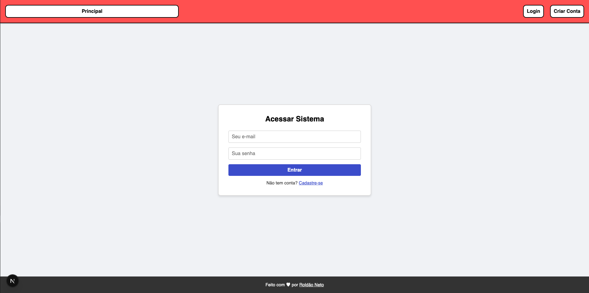
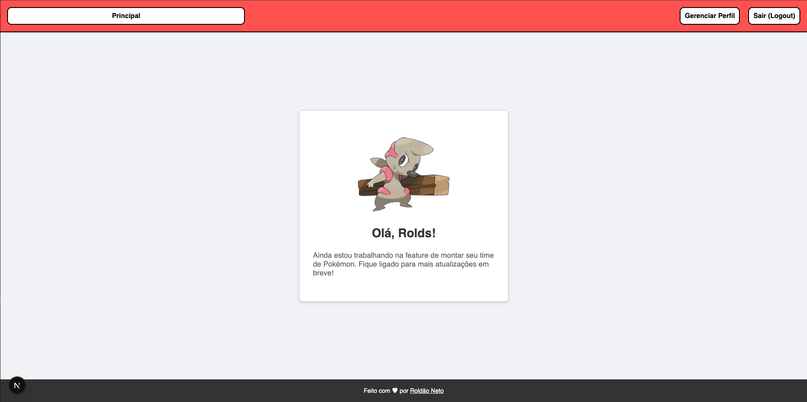
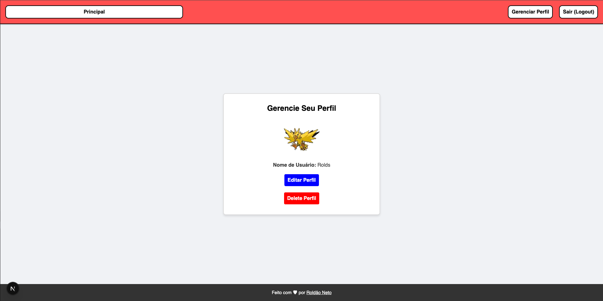
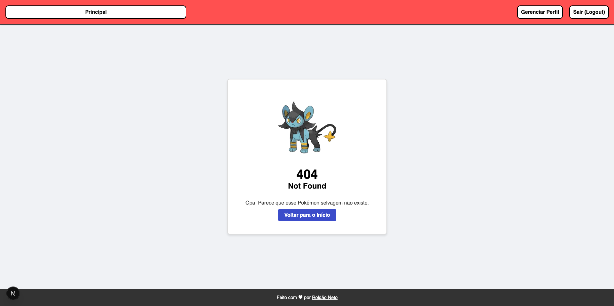

# Projeto-Final-Web

## 📖 Sobre o Projeto

O **PokeTeamMaker** é uma aplicação web desenvolvida para demonstrar fluxos avançados de autenticação e gerenciamento de usuários. O diferencial do "negócio" é a gamificação: ao se cadastrar, cada usuário recebe aleatoriamente um **Pokémon** da primeira geração (Kanto) como avatar, consumindo dados reais da [PokeAPI](https://pokeapi.co/).

O projeto foca em segurança e arquitetura limpa, utilizando criptografia reversível para e-mails, hash unidirecional para senhas e JWT para sessões.

## 🚀 Tecnologias Utilizadas

### Frontend

* **Next.js (App Router)**
* **TypeScript**
* **CSS**

### Backend

* **Node.js & Express**
* **JSON Database (em arquivo local)**
* **JWT (JSON Web Tokens)**
* **Bcrypt.js**: para senhas.
* **Crypto (Node nativo)**: para emails.

## 📸 Screenshots

Aqui estão algumas prévias das funcionalidades do projeto:

### Tela de Login e Cadastro



### Dashboard (Home Protegida)



### Gerenciamento de Perfil



### Página 404 Personalizada



## ✨ Funcionalidades

* **Cadastro de Usuário**: Sorteio automático de Pokémon via API externa.
* **Criptografia**: E-mails salvos criptografados (AES-256) e senhas em Hash.
* **Login Seguro**: Geração de Token JWT com validade de 1 hora.
* **Rotas Protegidas (Middleware)**: Apenas usuários com token válido acessam a Home e Perfil.
* **Gerenciamento de Perfil**: Usuário pode editar seus dados ou excluir sua conta.
* **Persistência Customizada**: Sistema próprio de leitura/escrita em arquivos JSON.

## 🔧 Como Rodar o Projeto

### Pré-requisitos

* Node.js
* NPM

### Configurando o Backend (Porta 3000)

Entre na pasta do backend, instale as dependências e configure as variáveis de ambiente.

```bash
cd backend
npm install
```

Crie um arquivo `.env` na raiz do diretório `backend` com as seguintes variáveis:

```env
KEY = sua_chave_de_criptografia_aqui
JWT_SECRET = sua_chave_jwt_aqui
```

### Iniciando a Aplicação:

Volte para a raiz do projeto e inicie o backend e frontend:

```bash
npm run dev
```

A aplicação estará disponível em `http://localhost:8888`.
